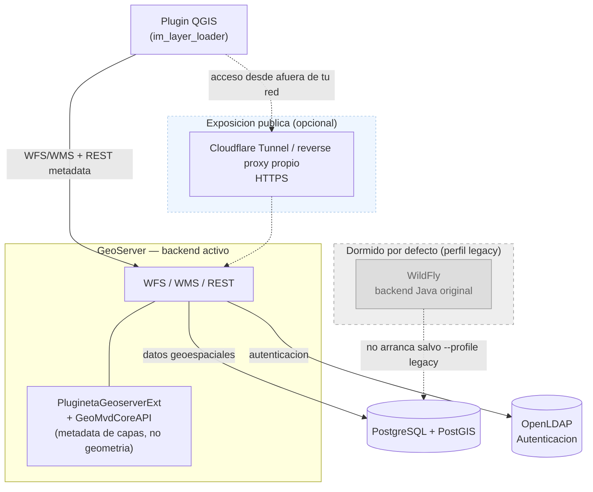

# Open Plugineta

Sistema de gestion de capas geoespaciales para QGIS, con GeoServer como backend y autenticacion LDAP.

## Descripcion

Open Plugineta es una plataforma que permite:

- **Cargar capas geoespaciales** en QGIS desde un servidor centralizado
- **Gestionar permisos** de acceso a capas por usuario/grupo via LDAP
- **Publicar mapas** a traves de GeoServer con autenticacion integrada
- **Editar geometria** directo contra GeoServer via WFS-T
- **Trabajar con multiples proyecciones** (CRS configurable por capa/workspace, no una unica proyeccion fija para toda la instalacion)

## Arquitectura

El backend que consume el plugin QGIS **es GeoServer mismo** — no un servidor de aplicaciones
Java aparte. `PluginetaGeoserverExt` es una extension nativa que corre *dentro* del proceso de
GeoServer (mismo JVM, mismo puerto) y expone la metadata/configuracion de capas que el plugin
necesita (atributos editables, codigueras, campos calculados). La geometria en si nunca pasa por
esta extension: el plugin habla WFS/WMS estandar directo contra GeoServer.



`GeoMvd-App`/`GeoMvd-App-ejb` (WildFly) fueron el backend original. Siguen completos en el repo
por si hace falta compararlos o volver atras, pero **no arrancan por defecto** — se levantan a
demanda con `docker compose --profile legacy up wildfly`. El `./build.sh` de la raiz del proyecto
compila ese WAR viejo; **no hace falta correrlo para usar la plataforma hoy** (ver
[Inicio Rapido](#inicio-rapido)).

## Componentes

| Componente | Descripcion | Puerto | Perfil |
|------------|-------------|--------|--------|
| **GeoServer** (+ `PluginetaGeoserverExt`) | Backend activo: WFS/WMS + metadata de capas | 8080 | default |
| **PostgreSQL + PostGIS** | Base de datos espacial | 5432 | default |
| **OpenLDAP** | Autenticacion de usuarios | 389 / 636 | default |
| **phpLDAPadmin** | Interfaz web para LDAP | 8081 | default |
| **cloudflared** | Tunel para exponer la demo a internet (opcional) | - | `tunnel` |
| **plugin-repo-publisher** | Reempaqueta el plugin QGIS con la URL publica horneada (opcional, corre una vez y termina) | - | `publish` |
| **WildFly** | Backend Java original (dormido, no se usa) | 8082 | `legacy` |

## Proyeccion y sistema de coordenadas

El CRS **no es una propiedad fija de toda la instalacion** — se resuelve por capa/workspace de
GeoServer, con un default configurable por instalacion si una capa no lo declara explicitamente.
La demo incluida trae **dos workspaces conviviendo** para probarlo:

| Workspace | EPSG | Descripcion |
|---|---|---|
| `workspace-demo` | 32721 (UTM 21S) | Datos de ejemplo centrados en Montevideo, Uruguay (metros) |
| `workspace-demo-4326` | 4326 (WGS84 lat/lon) | Mismos conceptos de datos, en la zona de Salto Grande |

Ambos se cargan igual desde el plugin, sin configuracion adicional — es la prueba de que agregar
un cliente en otra proyeccion no requiere tocar codigo, solo configurar el workspace/capa
correspondiente en GeoServer (y, si aplica, el `epsg` del `.ori` que describe esa capa en
`server/geoserver/data_dir/plugineta-config/apps/plugineta/`).

> Si vas a agregar tu propio dataset en una proyeccion nueva, el patron a seguir es el de
> `workspace-demo-4326`: un schema en PostGIS con la columna de geometria en el SRID que
> corresponda, un workspace de GeoServer con ese CRS, y el `.ori` describiendo el `epsg` real de
> la capa.

## Requisitos

- Docker Engine 20.10+ y Docker Compose 2.0+ (o [Colima](https://github.com/abiquo/colima) en
  macOS, ver nota abajo)
- QGIS 3.22+ (para el plugin)
- **JDK 8** y **JDK 17** (para compilar el backend activo — ver [Inicio Rapido](#inicio-rapido);
  no hace falta ninguno de los dos si nunca vas a recompilar la extension)
- Maven 3.6+
- 6GB RAM minimo disponible

> **Alternativa liviana a Docker Desktop en macOS**: si no querés/podés usar Docker Desktop
> (consume mucha RAM incluso ocioso), podés usar [Colima](https://github.com/abiquo/colima) como
> motor Docker — mismos comandos `docker`/`docker compose` de siempre. Ver
> [`docs/entorno-docker-sin-docker-desktop.md`](docs/entorno-docker-sin-docker-desktop.md).

## Inicio Rapido

### 1. Clonar el repositorio

```bash
git clone https://github.com/dti-montevideo/open-plugineta.git
cd open-plugineta
```

### 2. Configurar variables de entorno

```bash
cp .env.example .env
# Editar .env con tus valores si es necesario - ver comentarios en el archivo
```

### 3. Compilar el backend activo (extension de GeoServer)

Este paso es **necesario en un clon nuevo** — `target/` esta en `.gitignore`, asi que los `.jar`
que `docker-compose.yml` monta dentro de GeoServer no existen todavia. Sin este paso, GeoServer
arranca igual pero **sin la extension** (Docker monta un directorio vacio en lugar del jar
faltante, sin error visible — los endpoints de `/rest/plugineta/...` responden 404).

```bash
# 1) GeoMvdCoreAPI - libreria de logica de negocio (JDK 8 especificamente: el pom fija
#    source/target 1.8 y usa APIs removidas en JDK 11+)
cd geomvd/GeoMvdCoreAPI
JAVA_HOME=$(/usr/libexec/java_home -v 1.8) mvn install -DskipTests   # ajusta JAVA_HOME a tu JDK 8

# 2) PluginetaGeoserverExt - la extension que corre dentro de GeoServer (JDK 17: minimo que
#    exige GeoServer 2.28)
cd ../PluginetaGeoserverExt
JAVA_HOME=$(/usr/libexec/java_home -v 17) mvn package -DskipTests    # ajusta JAVA_HOME a tu JDK 17
cd ../..
```

> Detalle completo (dependencias, gotchas de empaquetado) en
> [geomvd/PluginetaGeoserverExt/doc/PLUGINETA_EXTENSION.md](geomvd/PluginetaGeoserverExt/doc/PLUGINETA_EXTENSION.md).

### 4. Iniciar los servicios

```bash
docker compose up -d
```

### 5. Verificar que los servicios esten corriendo

```bash
docker compose ps
```

`plugineta-geoserver` puede tardar hasta un minuto en pasar a `healthy` (su healthcheck tiene
`start_period: 2m` y `interval: 5m` — si a los pocos segundos todavia dice `starting`, es normal).

### 6. Acceder a los servicios

| Servicio | URL | Credenciales |
|----------|-----|--------------|
| GeoServer (admin) | http://localhost:8080/geoserver | admin / geoserver |
| phpLDAPadmin | http://localhost:8081 | cn=admin,dc=plugineta,dc=local / admin_password |

Usuarios LDAP de prueba para el plugin (ver tabla completa mas abajo): `admin_gis/admin123`,
`editor_gis/editor123`, `viewer_gis/viewer123`.

### 7. Instalar el plugin QGIS

Forma recomendada — como repositorio directo desde GeoServer (se actualiza solo, sin ZIPs
manuales):

1. En QGIS: **Complementos → Administrar e instalar complementos → Configuracion → Agregar**
2. URL: `http://localhost:8080/geoserver/rest/plugineta/repo/plugins.xml`
3. Pestaña **Todos**, buscar "Open Plugineta", instalar.

Otras formas de instalarlo (ZIP manual, copiar carpeta) en
[Generar el Plugin QGIS](#generar-el-plugin-qgis) mas abajo.

## Exponer la demo a internet

### Demo puntual, sin dominio propio (Cloudflare Tunnel)

Para que alguien fuera de tu red pruebe el plugin sin publicar tu IP y con HTTPS, sin cuenta ni
dominio propio:

```bash
docker compose --profile tunnel up -d cloudflared
docker compose logs cloudflared | grep trycloudflare.com   # imprime la URL asignada
```

Con esa URL (efimera — cambia si reiniciás `cloudflared`):

```bash
# .env
PLUGINETA_PUBLIC_URL=https://esa-url.trycloudflare.com

docker compose up -d geoserver                              # aplica PROXY_BASE_URL
docker compose --profile publish up plugin-repo-publisher   # hornea el plugin con esa URL
```

Repositorio del plugin para instalar desde cualquier maquina:
`https://esa-url.trycloudflare.com/geoserver/rest/plugineta/repo/plugins.xml`.

Detalle completo (por que Cloudflare Tunnel y no ngrok, troubleshooting) en
[`docs/entorno-docker-sin-docker-desktop.md`](docs/entorno-docker-sin-docker-desktop.md) y
[`geomvd/PluginetaGeoserverExt/doc/PLUGINETA_EXTENSION.md`](geomvd/PluginetaGeoserverExt/doc/PLUGINETA_EXTENSION.md#exponer-la-demo-afuera).

### Produccion, con un dominio propio

El mecanismo es el mismo, cambia solo el valor de `PLUGINETA_PUBLIC_URL` — no hace falta un
tunel si ya tenés un dominio real apuntando a tu servidor (por DNS) y HTTPS resuelto (por tu
propio reverse proxy/load balancer, delante de GeoServer):

```bash
# .env
PLUGINETA_PUBLIC_URL=https://plugineta.tu-dominio.gob

docker compose up -d geoserver
docker compose --profile publish up plugin-repo-publisher
```

Dos ajustes adicionales a revisar para un despliegue real (no hacen falta con un tunel de
Cloudflare/ngrok, que ya los resuelven del lado del proveedor):

- **`GEOSERVER_CSRF_WHITELIST`** (en `.env`): la proteccion CSRF del panel de administracion de
  GeoServer valida que el `Origin`/`Referer` coincida con un host conocido — agregá tu dominio
  real (`GEOSERVER_CSRF_WHITELIST=plugineta.tu-dominio.gob`) o las acciones AJAX del admin
  (ej. Data Security) van a fallar con 400. Ver
  [CSRF Protection, GeoServer docs](https://docs.geoserver.org/stable/en/user/security/webadmin/csrf.html).
- **TLS**: `PROXY_BASE_URL` le dice a GeoServer bajo que URL externa se lo ve (para que
  capabilities documents y redirecciones de login queden bien), pero el certificado/terminacion
  HTTPS en si la resuelve tu propio reverse proxy — GeoServer sigue sirviendo HTTP plano puertas
  adentro.

En ambos casos (tunel o dominio propio) la variable es la misma y alimenta las dos cosas a la
vez — no hay una config separada para "modo demo" vs. "modo produccion".

## Estructura del Proyecto

```
open-plugineta/
├── code/
│   ├── backend/                    # Backend Java original (WildFly, dormido)
│   │   ├── GeoMvd-App/             # Modulo WAR (perfil legacy)
│   │   ├── GeoMvd-App-ejb/         # Modulo EJB
│   │   └── specs/                  # Especificacion OpenAPI original
│   └── frontend/
│       └── im_layer_loader/        # Plugin QGIS
├── geomvd/
│   ├── GeoMvdCoreAPI/               # Logica de negocio (parseo .ori, calculos, datahandler)
│   └── PluginetaGeoserverExt/       # Backend ACTIVO: extension nativa de GeoServer
├── docker/
│   ├── init-db/                    # Scripts inicializacion PostgreSQL
│   └── ldap-init/                  # Configuracion inicial LDAP
├── server/
│   ├── geoserver/                  # Configuracion GeoServer (activo)
│   │   └── data_dir/               # Directorio de datos (versionado)
│   └── wildfly-docker/             # Dockerfile para WildFly (perfil legacy)
├── docs/                           # Guias operativas (Colima, tuneles, etc.)
└── docker-compose.yml
```

## Configuracion

### Backend activo (extension de GeoServer)

Ver [geomvd/PluginetaGeoserverExt/doc/PLUGINETA_EXTENSION.md](geomvd/PluginetaGeoserverExt/doc/PLUGINETA_EXTENSION.md)
para el detalle completo. Los archivos de config de capas (`.ori`/`_md.xml`/`config.properties`)
estan en `server/geoserver/data_dir/plugineta-config/apps/plugineta/`.

### Backend legacy (WildFly, opcional)

Solo relevante si revivís `--profile legacy`. Ver documentacion completa en
[code/backend/README.md](code/backend/README.md).

```bash
cp code/backend/Files/config.properties.example code/backend/Files/config.local.properties
```

### Plugin QGIS

Los archivos de configuracion estan en `code/frontend/im_layer_loader/modulos/properties/`:

```bash
# Copiar template de configuracion
cp code/frontend/im_layer_loader/modulos/properties/config.local.properties.example \
   code/frontend/im_layer_loader/modulos/properties/config.local.properties
```

### GeoServer con LDAP

Para configurar la autenticacion LDAP en GeoServer, ver [docker/configure-geoserver-ldap.md](docker/configure-geoserver-ldap.md).

Configuracion rapida:
1. Acceder a GeoServer: http://localhost:8080/geoserver
2. Ir a **Security** > **Authentication**
3. Agregar nuevo **LDAP Authentication Provider**:
   - Server URL: `ldap://ldap:389/dc=plugineta,dc=local`
   - User DN pattern: `uid={0},ou=users`
   - Group search filter: `(uniqueMember={0})`

## Usuarios LDAP de Prueba

| Usuario | Password | Grupos | Permisos |
|---------|----------|--------|----------|
| admin_gis | admin123 | GIS_ADMINS, GIS_EDITORS, GIS_VIEWERS | Acceso completo |
| editor_gis | editor123 | GIS_EDITORS, GIS_VIEWERS | Edicion |
| viewer_gis | viewer123 | GIS_VIEWERS | Solo lectura |

## Desarrollo

### Recompilar el backend activo despues de un cambio

```bash
cd geomvd/PluginetaGeoserverExt
JAVA_HOME=$(/usr/libexec/java_home -v 17) mvn package -DskipTests
docker compose restart geoserver
```

(`GeoMvdCoreAPI` solo hace falta reinstalarlo si tocaste ese modulo — no en cada cambio de la
extension.)

### Compilar el Backend legacy (WildFly, perfil `legacy`)

```bash
./build.sh
docker compose --profile legacy up -d wildfly
```

Instrucciones detalladas en [code/backend/README.md](code/backend/README.md).

### Generar el Plugin QGIS

**Opcion 1: como repositorio desde GeoServer (recomendado)** — ver
[paso 7 de Inicio Rapido](#7-instalar-el-plugin-qgis). Se actualiza solo, sin ZIPs manuales. Para
publicar una version nueva del plugin ahi (por ejemplo despues de editar el codigo del plugin):

```bash
docker compose --profile publish up plugin-repo-publisher
```

**Opcion 2: ZIP manual**

```bash
cd code/frontend
./build-plugin.sh
```

Esto genera `dist/im_layer_loader-{version}.zip`. En QGIS: **Complementos → Administrar e
instalar complementos → Instalar a partir de ZIP**.

**Opcion 3: copiar la carpeta directo al perfil de QGIS**

```bash
# Linux
cp -r code/frontend/im_layer_loader ~/.local/share/QGIS/QGIS3/profiles/default/python/plugins/

# macOS
cp -r code/frontend/im_layer_loader ~/Library/Application\ Support/QGIS/QGIS3/profiles/default/python/plugins/

# Windows
xcopy /E code\frontend\im_layer_loader %APPDATA%\QGIS\QGIS3\profiles\default\python\plugins\im_layer_loader
```

Luego reiniciar QGIS y activarlo en **Complementos → Administrar e instalar complementos**.

## API REST

El backend activo hoy **no es WildFly** — es una extension nativa de GeoServer
(`PluginetaGeoserverExt`), que corre dentro del propio proceso de GeoServer y es la que
consume el plugin QGIS real. WildFly queda dormido en el repo (perfil `legacy`), sin
arrancar por defecto.

- Especificacion OpenAPI (API activa): [geomvd/PluginetaGeoserverExt/doc/openapi.yml](geomvd/PluginetaGeoserverExt/doc/openapi.yml)
- Documentacion de endpoints, como testearlos y donde van los `.ori`: [geomvd/PluginetaGeoserverExt/doc/PLUGINETA_EXTENSION.md](geomvd/PluginetaGeoserverExt/doc/PLUGINETA_EXTENSION.md)
- Especificacion original (WildFly, dormida): [code/backend/specs/openapi.yaml](code/backend/specs/openapi.yaml)

### Endpoints principales (GeoServer, activos)

| Metodo | Endpoint | Descripcion |
|--------|----------|-------------|
| GET | `/geoserver/rest/plugineta/public/{appName}/layers` | Obtener capas de una aplicacion |
| GET | `/geoserver/rest/plugineta/public/{appName}/layers/atributocapaformat` | Metadata/atributos de una capa |
| GET | `/geoserver/rest/plugineta/public/{appName}/layers/codiguerasdata` | Datos de codigueras |
| POST | `/geoserver/rest/plugineta/public/{appName}/layers/getCalcFields` | Campos calculados |
| GET | `/geoserver/rest/plugineta/repo/plugins.xml` | Repositorio del plugin QGIS (publico, sin auth) |

Los primeros 4 requieren HTTP Basic Auth con un usuario LDAP valido (ver
[geomvd/PluginetaGeoserverExt/doc/PLUGINETA_EXTENSION.md](geomvd/PluginetaGeoserverExt/doc/PLUGINETA_EXTENSION.md) para
ejemplos de `curl` y guia de testeo).

## Troubleshooting

### GeoServer no inicia, o la extension no responde (404 en `/rest/plugineta/...`)

```bash
# Ver logs
docker compose logs geoserver

# Confirmar que los jars de la extension existen (ver paso 3 de Inicio Rapido si no)
ls geomvd/PluginetaGeoserverExt/target/*.jar geomvd/GeoMvdCoreAPI/target/*.jar

# Reiniciar
docker compose restart geoserver
```

### Error de conexion a LDAP

```bash
# Verificar que LDAP esta corriendo
docker compose ps ldap

# Probar conexion
ldapsearch -x -H ldap://localhost:389 -b "dc=plugineta,dc=local" -D "cn=admin,dc=plugineta,dc=local" -w admin_password
```

### Base de datos no responde

```bash
# Ver logs
docker compose logs db

# Verificar estado
docker exec plugineta-postgis pg_isready -U gis_user -d gis_database
```

## Documentacion Adicional

- [Extension de GeoServer (backend activo): endpoints, testing, .ori, exponer la demo](geomvd/PluginetaGeoserverExt/doc/PLUGINETA_EXTENSION.md)
- [Correr el stack sin Docker Desktop (Colima) + exponer la demo con Cloudflare Tunnel](docs/entorno-docker-sin-docker-desktop.md)
- [Backend Java original (compilacion y despliegue, WildFly, dormido)](code/backend/README.md)
- [Configuracion de Docker](docker/README.md)
- [Configuracion de GeoServer](server/README.md)
- [Configuracion LDAP para GeoServer](docker/configure-geoserver-ldap.md)

## Licencia

Este proyecto esta licenciado bajo la [GNU General Public License v3.0](LICENSE).

## Contribuir

Las contribuciones son bienvenidas. Por favor, abrir un issue antes de enviar un pull request para discutir los cambios propuestos.
